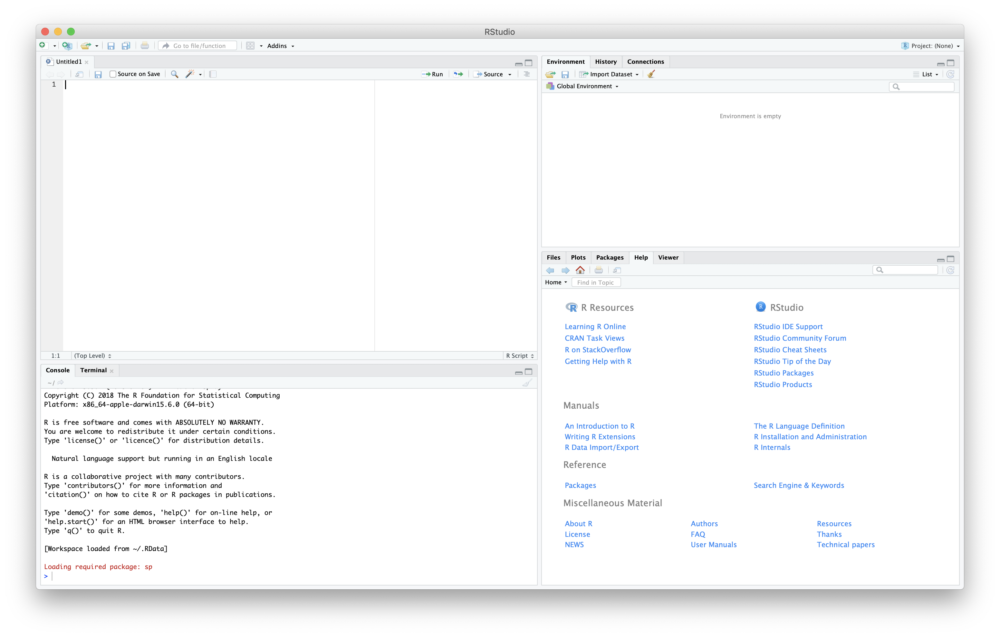

```{r setup, include=FALSE}
if (!require(tufte)) install.packages('tufte')
knitr::opts_chunk$set(echo = FALSE)
set.seed(42)
```


# Hva er R?

## Hva er R? {.flexbox .vleft}

- R er et høynivå programmeringsspråk beregnet (primært) for statistikk, men med svært mange bruksområder
- R brukes innen en rekke sektorer og fagområder (inkludert Riksrevisjonen `r emo::ji('smiley')`) og er et av de viktigste verktøyene innen data science
- I utgangspunktet skjer alt arbeid i R via et terminalvindu ved å skrive inn kommandoer, men verktøy som *RStudio* og *R Commander* gjør det lettere å jobbe med R

## Hva kan R brukes til? {.flexbox .vleft}

Kortversjonen: det meste

Den (litt) lengre versjonen:

- Datahøsting og datamanipulering
- Dataanalyse og modellering, inkludert maskinlæring (kunstig intelligens)
- Datavisualisering
- Analyse av ustrukturerte data
- Webapplikasjoner (med Shiny)
- Produksjon av rapporter og dokumentasjon av analyser (med Rmarkdown)
- Denne presentasjonen

## Hva bruker vi R til i Riksrevisjonen? {.flexbox .vleft}

- Innhenting av data fra nett og via APIer (webscraping)
- Statistiske analyer og utprøving av maskinlæring
- Bearbeiding av data, blant annet fra datafangst
- Analyse og visualisering av geodata
- Utvikling av mindre webapplikasjoner (slik som Løvehulen, Rapportsøk, og Kommunekart)
- Og mye, mye, mer

## Dataanalyse i R {.flexbox .vleft .extraspace}

- Enorme muligheter for dataanalyse i R
- R håndterer både _strukturerte_ og _ustrukturerte_ data
- En rekke innebygde funksjoner for statistisk analyse, og kan utvides til de fleste analyseformål
- God støtte for datavisualiseringer, både innebygget og via utvidelser (pakker)

## Koding i R {.flexbox .vleft}

- R er primært _tekstbasert_
- Vi kan jobbe i en _konsoll_ hvor vi skriver inn kommandoer (kode) direkte, eller med et _skript_
- Vi jobber ikke direkte med filer, men med et _miljø_ (environment) som inneholder _objekter_
- _Objekter_ i R kan være tradisjonelle tabeller med data i rader og kolonner, men også variabler, innholdet på en nettside, geografiske data, eller mye mer

## Pakker i R {.flexbox .vleft}

* R kan utvides med _pakker_ som gir R ny funksjonalitet
* Per i dag er det flere enn 16.000 pakker tilgjengelig via CRAN
* Få pakker i dette kurset, men vi vil bruke flere pakker i kurset om **webscraping**

# Demo av RStudio

## RStudio 

```{r out.width='80%', fig.align='center'}

```

# Grunnleggende bruk av R 

## R som kalkulator

```{r, echo=TRUE}
# Vi kan utføre enkel aritmetikk med +, -, *, /, og ^
3 + 3  # Addisjon
3 * 3  # Multiplikasjon
3 ^ 3  # Eksponent
```

## Regnerekkefølge i R

1. parenteser
2. potenser og røtter
3. multiplikasjon og divisjon
4. addisjon og subtraksjon

```{r, echo=TRUE}
3 + 3 * 3
(3 + 3) * 3
```

## Prøv selv! {.flexbox .vleft}

Løs følgende i R:

$$3.75 \times 4$$
$$5 ^ 2 - 8$$
$$(2 + 10) \times -3$$
$$2\pi \times 3$$

# Datastrukturer i R 

# Innebygde funksjoner i R 

## Bruk av funksjoner

R har en rekke innebygde funksjoner. Noen eksempler er:

* Summer verdiene i en vektor med `sum()` 
* Finn unike verdier i en vektor med `unique()`
* Vis innholdet i en variabel med `print()` 
* Opprett en matrise med `matrix()`

For en liste over viktige basisfunksjoner, se 
[http://adv-r.had.co.nz/Vocabulary.html](http://adv-r.had.co.nz/Vocabulary.html)

## Argumenter

- Funksjoner kan ha ett eller flere _argumenter_
- Noen argumenter må angis, andre er valgfrie
- Du kan bruke `help()` eller `?` for å få informasjon om en funksjon og alle argumenter
- Se hva som skjer hvis du prøver å skrive `dim()` i konsollen

## Argumenter
```{r, eval=TRUE, echo=TRUE, error=TRUE}
dim()
```

Få mer informasjon om funksjonen `dim()`
```{r, eval=FALSE, echo=TRUE}
?dim
```

## Oppgaver {.flexbox .vleft .extraspace}

* Sjekk ut hjelpesiden til funksjonen `sum`. Hvilke argumenter tar funksjonen?
* Lag en vektor `x <- c(1:10, NA)`. 
* Hva er summen av `x` ? 
* Hva er gjennomsnittet av `x` ? 
* Hva er standardavviket til `x` ? 

## Argumenter 

Det er mulig å bruke både _posisjonsbaserte_ og _navngitte_ argumenter.   

```{r echo=TRUE}
args(sample)
```

## Posisjonsbaserte argumenter

Sett verdier for de to argumentene `x` og `size` basert på deres posisjon.

```{r echo=TRUE}
args(sample)
``` 
```{r echo=FALSE}
set.seed(42)
``` 
```{r echo=TRUE}
sample(1:10, 1)
```

## Navngitte argumenter 

Sett verdier for de to argumentene `x` og `size` basert på argumentenes navn.  

```{r echo=FALSE}
set.seed(42)
``` 
```{r echo=TRUE}
# Sett verdier med navngivning 
sample(x = 1:10, size = 1)
```
```{r echo=FALSE}
set.seed(42)
``` 
```{r echo=TRUE}
# Du kan stokke om på argumentene dersom du navngir dem 
sample(size = 1, x  = 1:10)
```


## Standardverdier for argumenter 

```{r echo=TRUE}
args(sum)
args(sample)
``` 

## Oppgaver {.flexbox .vleft .extraspace}

* Sjekk ut hjelpesiden til funksjonen `sample`. Hvilke argumenter tar funksjonen?
* Lag en vektor `my_vec` med 5 tilfeldig heltall trukket fra en vektor med alle tallene fra `10` til `20`. 
* Hva skjer hvis du setter `replace` til `TRUE`? 
* Hva skjer hvis du setter et seed, `set.seed(42)`, før du kjører funksjonen? 


## Vektoriserte funksjoner 

En *vektorisert funksjon* er en funksjon som utfører en operasjon ikke bare på én enkelt verdi, men en hel vektor med verdier. R har flere slike innebygde vektoriserte funksjoner. 

## Vektoriserte funksjoner  

```{r echo=TRUE}
x <- c(1,2,3)
y <- c(4,5,3)
```
```{r echo=TRUE}
x + y 
x * y
x / y
```

## Vektoriserte funksjoner 

```{r echo=TRUE}
my_text <- c("Hello world", "Code is poetry", "Great work!")
print(my_text)
my_num <- 1:10
sqrt(my_num)
```


# Innlesing av data

## Kilder til data {.flexbox .vleft .extraspace}

* Flatfiler (semikomma- eller kommaseparerte filer)
* Excel-filer
* Filer fra statistikkpakker (Stata, SAS, SPSS)
* Databaser (SQL)
* APIer over internett (Stortingets API, SSB)
* Skytjenester (AWS, Hadoop)

## Les inn data med basefunksjoner {.flexbox .vleft}

* R har innebygde funksjoner (fra `utils`) for å lese inn tekstbaserte filer
* Vanligste dataformat for tabulære data er CSV
* Funksjonen `read.csv` leser inn _kommaseparerte_ filer
* Funksjonen `read.csv2` leser inn _semikolonseparerte_ filer

## Vanlige problemer {.flexbox .vleft}

To vanlige problemer med å lese inn data:

1. R forsøker å konvertere tekstvariabler til faktorer
2. Norske tegn (alle ikke-ASCII-tegn) leses inn feil på grunn av problemer med tekstkoding (encoding)

Løsninger:

* Les inn data med argumentet `stringsAsFactors` satt til `FALSE`
* Tekstkodingen kan angis med `encoding`: `CP1252` er vanlig på Windows, mens `UTF-8` er vanlig på macOS og web (for det meste)
* **Hvis du kan velge tekstkoding på rådata, velg alltid UTF-8**

## Oppgaver

**Husk at du kan bruke `?read.csv` for å få informasjon om funksjonen!**

OPPGAVER HER!

## readxl {.flexbox .vleft}

To viktige funksjoner:

* `excel_sheets` og
* `read_excel`

`read_excel()` støtter både `xlsx` og `xls`-filer, og vil gjette type basert på filnavn. Hvis du vet hvilket format du skal lese, kan du bruke `read_xls()` eller `read_xlsx()`

## Oppgave {.flexbox .vleft .extraspace}

+ eks med stringsAsFactors()
+ forklare tibble med readxl

1. Les inn fila `carseats.csv` med `read.csv()` til objektet `carseats`
2. Bruk `head(carseats)` for å se de første observasjonene
3. Bruk `sum()` og `mean()` for å finne sum og gjennomsnitt på variablene `Sales` og `Price`

# Kontrollflyt 

## Likhet

I R kan vi teste for likhet med `==` og ulikhet med `!=`:

```{r, echo=TRUE}
TRUE == FALSE
TRUE == TRUE
FALSE != TRUE
FALSE != FALSE
```

## Likhet

```{r, echo=TRUE}
# Vi kan teste om tekst er lik
'Riksrevisjonen' == 'riksrevisjonen'
# Eller om numeriske verdier er like
16 ^ 4 == 1024 * 64
# Eller sammenligne logiske verdier med numeriske (TRUE er 1)
TRUE != 0
```


## Større og mindre enn

Vi tester om en verdi er større med `>`, større eller lik med `>=`, mindre med `<` og mindre eller lik med `<=`:

```{r, echo=TRUE}
16 ^ 4 >= 8 * 1024
```


## Større og mindre enn

Vi kan også sammenligne vektorer:

```{r, echo=TRUE}
x <- c(4, 20, 16, 34, 18, 32, 28, 31)
x > 25
x <= 20
```


## Oppgaver!

* Er uttrykket `-6 * 4 + 5` **større enn** `-3 * 8 - 4`?
* Er summen av `c(TRUE, FALSE, TRUE)` **lik eller større enn** `2`

## Logiske operatorer

I R bruker vi følgende logiske operatorer

* `&` for OG
* `|` for ELLER
* `!` for IKKE

## Logiske operatorer

```{r, echo=TRUE}
TRUE & TRUE
TRUE | FALSE
!FALSE
```


## Hvis

Vi kan teste for om en betingelse er **sann** (om et uttrykk vil evaluere til `TRUE`) med `if`.

`if` har følgende struktur i R:

```
if (betingelse) {
  uttrykk
}
```

## Hvis ... eller

```
if (betingelse) {
  uttrykk
} else if (betingelse) {
  uttrykk
} else {
  uttrykk
}
```

## Hvis

```{r, echo=TRUE}
x <- 9
if (x %% 2) {
  'Delelig med 2'
} else if (x %% 3) {
  'Delelig med 3'
} else {
  'Ikke delelig med 2 eller 3'
}
```


## Hvis

Pass på hvordan du skriver `if ... else` kode:

```{r, echo=TRUE, error=TRUE}
if (FALSE) {
  print('Sant')
}
else {
  print('Ikke sant')
}
```


## Hvis

* `if ... else` virker kun på én logisk verdi
* For å sammenligne en _vektor_ av verdier, kan du bruke `ifelse`
* `ifelse` tar _tre_ argumenter: en vektor, verdien som skal returneres hvis **sann** og verdien som skal returneres hvis **ikke sann**

```{r, echo=TRUE}
x <- c(14, 6, 2, 4, 5, 10)
ifelse(x >= 10, 'Over', 'Under')
```


## Oppgaver (1)

Bruk et R-skript for å skrive koden for disse oppgavene

* Skriv kode som returerer `Sant` hvis uttrykket `abs(-20)` er **større enn** `0`

## Oppgaver (2)

Lag en ny vektor `x` med verdiene `17, 33, 3, 32, 29, 8, 12, 22, 29, 41`.

* Skriv kode som returnerer `0` hvis verdien av hver enkel verdi av `x` er **mindre enn** 20 og `1` hvis verdien er **større eller lik** 20

Lag en vektor `a` med verdiene `3, 2, 1` og en vektor `b` med verdiene `1, 2, 3` (kan forkortes til `3:1` og `1:3`).

* Skriv kode som returnerer `Lik` hvis uttrykket `a == b` er **sant** og `Ulik` hvis ikke
* Forklar resultatet av denne koden

## Looper

`for` og `while`

```{r, echo=TRUE}
for (x in 1:5) {
  print(paste(rep('a', x), collapse = ''))
}
```

## while


## Apply-familien {.flexbox .vleft}

* Looper kan være praktiske, men de er også veldig _ineffektive_
* R har en serie med funksjoner som gjentar en funksjon over en `list`e eller `vector`
* `lapply` bruker en funksjon over en liste av elementer og returnerer en liste
* `sapply` er lik `lapply`, men returnerer en vektor eller matrise (alt etter hva funksjonen får som input)

## lapply

```{r, echo=TRUE}
# Opprett en liste x med 3 elementer og ta gjennomsnittet av hvert element
x <- list(a = 1:10, b = runif(10, 0, 10), c = seq(1, 28, 3))
lapply(x, mean)
```

# Egne funksjoner 

## Egne funksjoner 

```{r, echo=TRUE}
# Lag funksjonen  
myHello <- function(){
 print('Hello world!') 
}
```
```{r, echo=TRUE}
# Bruk funksjonen  
myHello()
```

## Egne funksjoner 

```{r, echo=TRUE}
myPrint <- function(x){
 print(x)
}
```
```{r, echo=TRUE}
myPrint("Hello world!")
myPrint("Code is poetry.")
```

## Lag din første funksjon  

Her definerer vi en funksjon, `square`, som tar et argument `n` og returnerer resultatet av dette tallet multiplisert med seg selv. 

```{r, echo=TRUE, comment='#>', collapse=TRUE}
# En funksjon for å gange et tall med seg selv 
square <- function(n){
  n * n  
} 
square(2)
square(16)
square(-4)
```

## Oppgaver {.flexbox .vleft .extraspace}

1. Lag en funksjon `double` som tar et argument `x` og returnerer resultatet av `x` multiplisert med 2.  
2. Bruk funksjonen på tallene 3, 4, 12 og 54.  


## Flere argumenter 

Her definerer vi en funksjon `power` som tar to argumenter `x` og `y` og returnerer resultatet av `x` opphøyd i `y`. 

```{r, echo=TRUE, comment='#>', collapse=TRUE, error=TRUE}
# En funksjon for å opphøye ett tall i et annet 
power <- function(x, y){
  x ^ y  
}
power(2, 3)
power(x = 2, y = 3)
```

## Standardverdier for argumenter  

Men merk at du må spesifisere begge argumentene i funksjonen.

```{r, echo=TRUE, comment='#>', collapse=TRUE, error=TRUE}
# En funksjon for å opphøye ett tall i et annet 
power <- function(x, y){
  x ^ y  
}
power(2) # Dette funker ikke... 
```

## Standardverdier for argumenter  

Som vi har satt i mange av Rs innebygde funksjoner, er det mulig å sette standardverdier for argumentene i funksjonen. Her har vi definert tallet 2 som standardverdi for eksponenten (`y`). 

```{r, echo=TRUE, comment='#>', collapse=TRUE, error=TRUE}
# En funksjon for å opphøye ett tall i et annet 
power <- function(x, y = 2){
  x ^ y  
}
power(2)
power(2, 2)
power(2, 3)
```

## Oppgaver {.flexbox .vleft .extraspace}

1. Lag en funksjon `multiply` som tar argumentene `x` og `y` og returnerer resultatet av `x` multiplisert med `y`. 
2. Test funksjonen med  `multiply(2, 3)`, `multiply(4, 3)` og `multiply(x = 3, y = 6)`. 
3. Legg til `7` som standardargument for `y`. Hva er resultatet av `multiply(6)` og `multiply(y = 6)`? 
4. Hva er resultatet av  `multiply("2", "3")`? 

## En funksjons robusthet

Funksjonen `square` fungerer kun på numeriske tallverdier. 

```{r, echo=TRUE, comment='#>', collapse=TRUE, error=TRUE}
# En funksjon for å gange et tall med seg selv 
square <- function(n){
  n * n  
}
square("2") 
```


## Kontrollflyt i en funksjon 

Vi kan legge til kontrollstrukturer inne i en funksjon. Her bruker vi en `if` betingelse for å konvertere `n` til en numerisk verdi **dersom** det i utgangspunktet er en tekststreng. 

```{r, echo=TRUE, comment='#>', collapse=TRUE}
square <- function(n){
  # Konverter tekst til numerisk  
  if(is.character(n)){
    n <- as.numeric(n)
  }
  # Multipliser 
  n * n  
} 
square("2")
```

## Oppgaver {.flexbox .vleft .extraspace}

1. Skriv om `multiply` funksjonen slik at den håndterer tekstrenger som inputverdier for både `x` og `y`. 
2. Test funksjonen med `multiply(2, 3)` og `multiply("2", "3")`. 
3. Test funksjonen med verdiene `x = list("10")` og ` y = data.frame(x = 10)`.
4. Klarer du skrive om funksjonen til å håndtere ikke numeriske verdier generelt? 

# God kodepraksis 

## Gode kodepraksis 

<p>&nbsp;</p>
<p>&nbsp;</p>
> *Any fool can write code that a computer can understand. Good programmers write code that
humans can understand.*
> `r tufte::quote_footer('--- Martin Fowler, 2008')`

## God kodepraksis {.extraspace}

* Koden må gjøre det den skal (altså være riktig)
* Koden må være *reproduserbar* (bruk skript, ikke GUI)
* Koden bør være *leselig* (også for mennesker)
* *Ikke repeter* deg selv (funksjoner er din venn)
* Følg gjerne en *konskevent kodestil* 

## Noen tips til koding i R 

* Start hvert nye skript med `rm(list = ls())` 
* Husk på hvilket arbeidsområde du er i (bruk `getwd()` og `setwd()`) 
* Bruk `<-` som tilordningsoperator (hurtigtast `'Alt + -'` i RStudio )  
* Gi variabler og objekter beskrivende navn
* Unngå navn som også er interne R funksjoner, eks. bruk `the_list <- list(1:10)` fremfor `list <- list(1:10)`
* Skriv kommentarer til koden din underveis (med `#`)
* Lag overskrifter i skript (hurtigtast `'Ctrl + Shift + R'` i RStudio)

## Hurtigtaster i RStudio

| Beskrivelse               | Hurtigtast        |       
| --------------------------|:-----------------:|
| Tilordningsoperator (`<-`)| `Alt + -`         |  
| Kjør gjeldende kodelinje  | `Ctrl + Enter`    | 
| Kjør gjeldende skript     | `Ctrl + Alt + R`  | 
| Lagre et skript           | `Ctrl + S`        | 
| Opprett nytt skript       | `Ctrl + Shift + N`| 
| Kommenter ut kodelinjer   | `Ctrl + Shift + C`| 
| Lag overskrift i skript   | `Ctrl + Shift + R`| 

