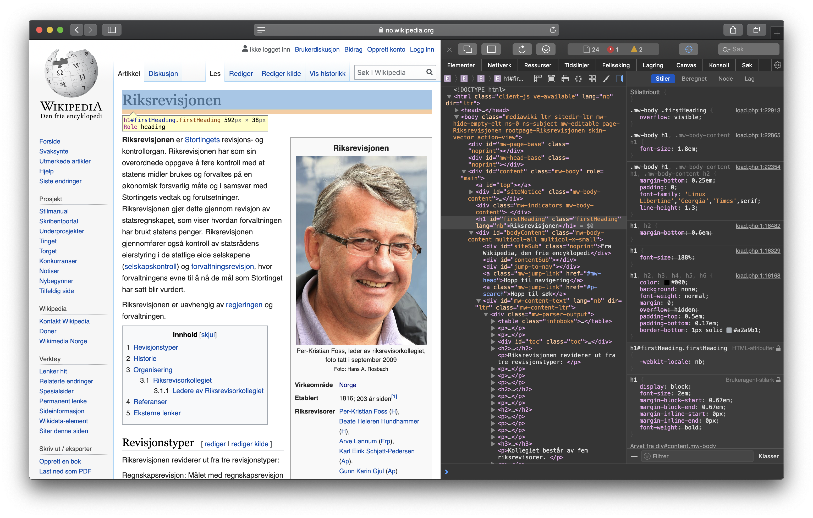
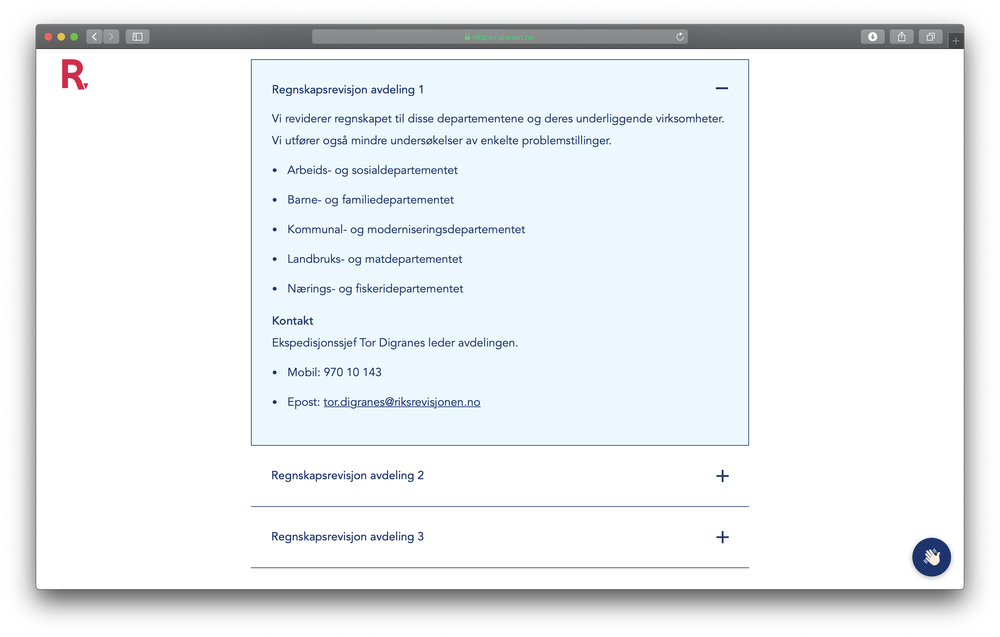
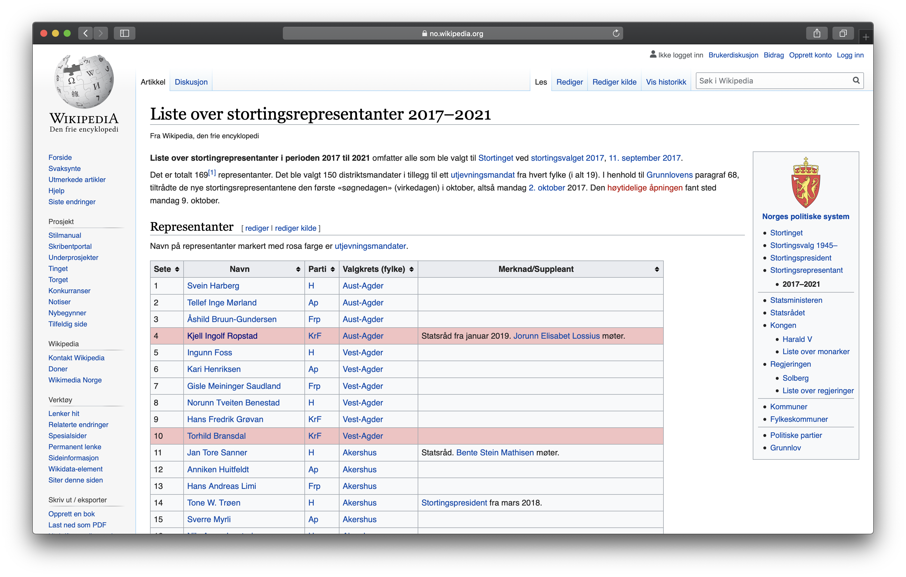
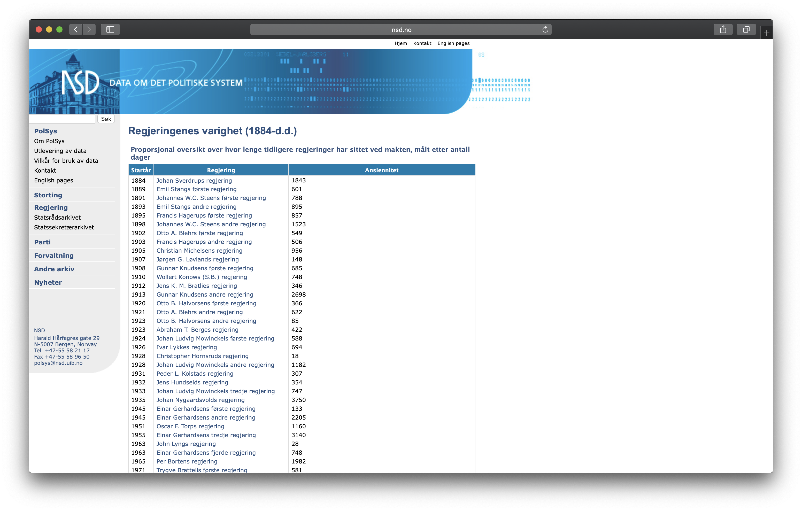
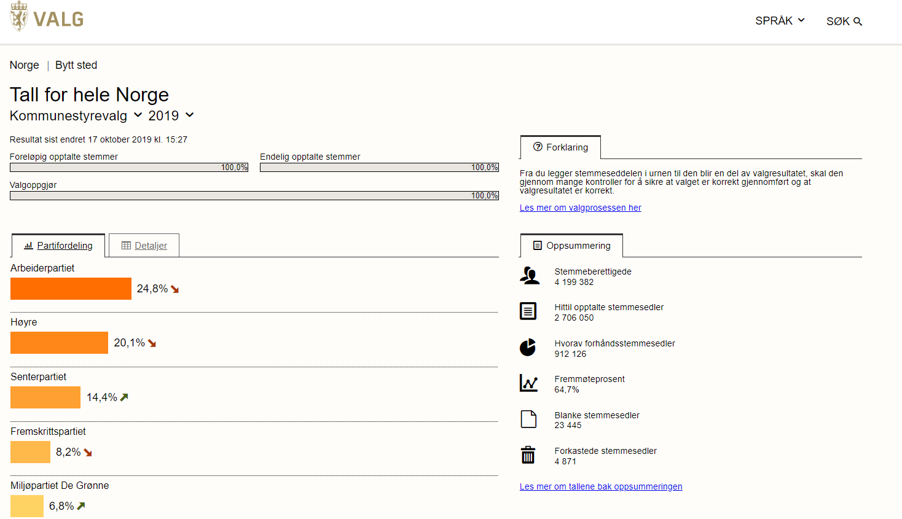
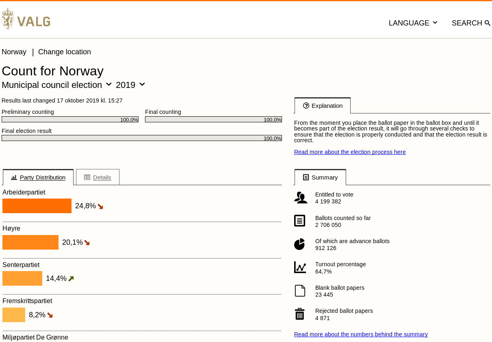
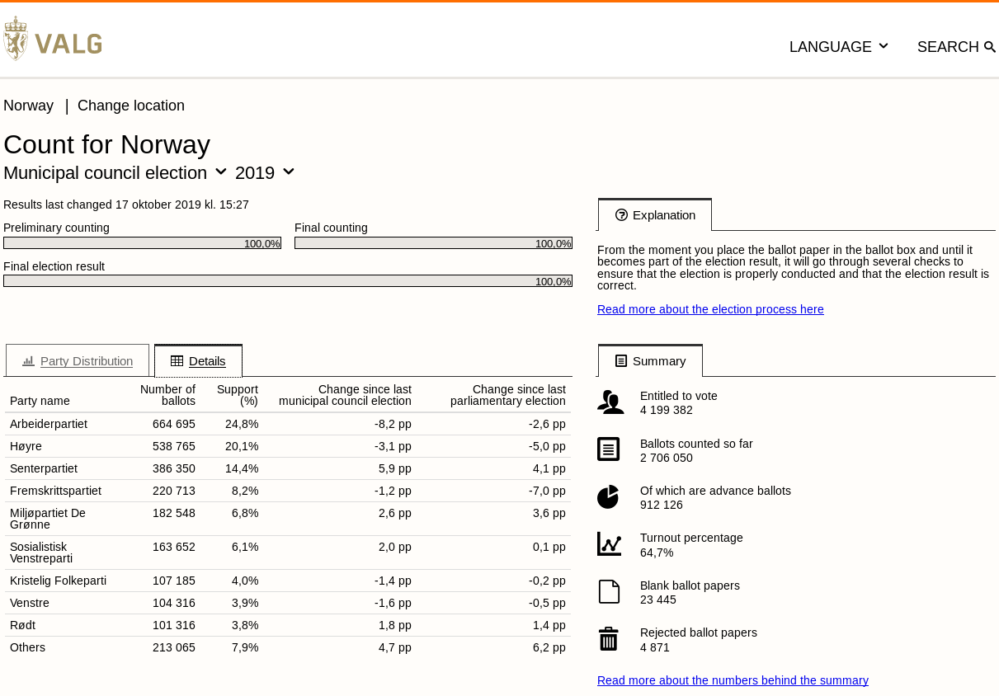

```{r setup, include=FALSE}
if (!require(tufte)) install.packages('tufte')
if (!require(rvest)) install.packages('rvest')
knitr::opts_chunk$set(echo = FALSE)
set.seed(42)
library(rvest)
```

# Hva er webscraping?

## Webscraping {.flexbox .vleft}

Webscraping handler om å trekke ut data fra nettsider (kan også brukes for å finne og laste ned _filer_ som er tilgjengelig fra en webserver).

Webscraping i R kan deles inn i tre hovedaktiviteter:

1. Lese inn HTML-sider som et objekt i R
2. Identifisere hvilke elementer i HTML-dokumentet som inneholder de data vi vil ha
3. Trekke ut informasjonen og strukturere den slik at den er klar for analyse

## Bruk av webscraping i Riksrevisjonen {.flexbox .vleft .extraspace}

* Automatisk innhenting av styredokumenter fra helseforetakene
* Innhenting av data fra NSDs database for høyere utdanning
* Sakspapirer fra norske kommunestyrer
* Data om hjelpemidler tilgjengelig fra hjelpemiddelsentralen
* Innhente nøkkeltall for fylkesmennene

# Strukturen til en nettside

## HTML {.flexbox .vleft .extraspace}

* Alle nettsider er bygget opp med HTML (Hyper Text Markup Language)
* HTML bruker en spesiell syntaks for å fortelle nettleseren hvordan en side skal vises
* HTML-syntaks består av _elementer_ slik som `<body>`, `<p>` og ``
* Elementer i HTML har en nøstet struktur
* I tillegg til HTML, benyttes CSS og JavaScript for å utforme nettsider og gi interaktiv funksjonalitet

## Anatomien til et element {.flexbox .vleft}

Et element i HTML består av følgende deler:

* En åpningskode (tag)
* En avslutningskode (tag) *
* Navngitte attributter (med eller uten verdier)
* Innholdet i elementet

```html
<h1 id="title">Overskrift</h1>
```

\* Ikke alle elementer har en avslutningskode

## Dokumentstruktur

```html
<!DOCTYPE html>
<html>
  <head>
    <meta charset="utf-8">
    <title>Sidetittel</title>
  </head>
  <body>
    <h1>Dette er en tittel på nivå 1 i HTML</h1>
    <p>Dette er et avsnitt i HTML</p>
  </body>
</html>
```

## Vanlige elementer i HTML

| Element   | Beskrivelse           |       
| ----------|:---------------------:|
| h1-h6     | Overskrift nivå 1-6   |
| div       | Generelt blokkelement |
| p         | Avsnitt               |
| ol        | Ordnet liste          |
| ul        | Uordnet liste         |
| li        | Listeelement          |

## Vanlige elementer i HTML

| Element   | Beskrivelse             |       
| ----------|:-----------------------:|
| em        | Kursiv (emphasis)       |  
| strong    | Uthevet (strong)        |
| span      | Generelt inline element |
| img       | Bilde                   |

## Blokk og inline elementer

```html
<div>
  <h2>Dette er en tittel på nivå 2</h2>
  <p>Dette er et avsnitt som har <strong>uthevet tekst</strong></p>
  <p>Dette er et avsnitt som har <em>kursiv tekst</em></p>
  <p>Dette er et avsnitt som har <span style="color: red;">rød tekst i et inline
     element</span>.</p>
</div>
```

<div>
  <h2>Dette er en tittel på nivå 2</h2>
  <p>Dette er et avsnitt som har <strong>uthevet tekst</strong>.</p>
  <p>Dette er et avsnitt som har <em>kursiv tekst</em>.</p>
  <p>Dette er et avsnitt som har <span style="color: red;">rød tekst i et inline element</span>.</p>
</div>

## Lister i HTML

```html
<ul>
  <li>Tromsø</li>
  <li>Stavanger</li>
  <li>Kristiansand</li>
  <li>Ålesund</li>
</ul>
```

```html
<ol>
  <li>Tromsø</li>
  <li>Stavanger</li>
  <li>Kristiansand</li>
  <li>Ålesund</li>
</ol>
```

## Nøstede lister i HTML

```html
<ul>
  <li>Oslo
    <ol>
      <li>Alna</li>
      <li>Bjerke</li>
      <li>Frogner</li>
      <li>Gamle Oslo</li>
    </ol>
  </li>
</ul>
```

## Attributter {.flexbox .vleft}

* Elementer kan ha _attributter_
* Attributter har normalt _verdier_, men kan også være _boolske_
* Attributter angis innenfor åpningskoden til elementet
* Noen elementer har alltid attributter, slik som hyperkoblinger `<a>`

```html
<h1 class="title uppercase" id="title">Overskrift</h1>
```

## Attributter {.flexbox .vleft}

```html
<a href="https://riksrevisjonen.no/" target="_blank">Lenke til Riksrevisjonen</a>
<a href="/rapporter/">Lenke til rapporter</a>
```

* Hyperkoblinger lages med elementet `<a>`
* Koblinger defineres med attributtet `href`
* Hvor koblingen skal åpnes defineres med attributtet `target`
* Koblinger til samme server trenger ikke `http(s)` eller `server.com`

## Document Object Model (DOM)

<pre><div style="padding: .2em; margin: .2em 0; background-color: #ededfd;">Window<div style="padding: .2em; margin: .2em 0; background-color: #f6c2c2;">Document<div style="padding: .2em; margin: .2em 0; background-color: #ffffc8;"><span>Element</span><div style="padding: .2em; margin: .2em 0; background-color: #d9ffc8;"><span>Element</span></div><div style="padding: .2em; margin: .2em 0; background-color: #d9ffc8;"><span>Element</span></div></div><div style="padding: .2em; margin: .2em 0; background-color: #ffffc8;"><span>Element</span><div style="padding: .2em; margin: .2em 0; background-color: #d9ffc8;"><span>Element</span></div><div style="padding: .2em; margin: .2em 0; background-color: #d9ffc8;"><span>Element</span></div></div></div></div></pre>

## Document Object Model (DOM)

```html
<div>               <!-- Forelder/besteforelder -->
  <p>Første</p>     <!-- Etterkommer -->
  <p>Andre</p>      <!-- Søsken -->
  <div>             <!-- Etterkommer/forelder -->
    <p>Neste</p>    <!-- Etterkommer -->
  </div>
</div>
```

## Oppgave

Åpne fila `webscrape.html` fra ditt hjemmeområde.

1. Lag et element av typen `p` med klassen `mitt-element` og skriv tekst inn i denne
2. Lag et nytt element av typen `ul` med klassen `min-liste`
3. Lag minst tre listeelementer inne i elementet du opprettet i forrige steg. Skriv tekst inn i hvert listeelement
4. Legg til attributtet `data-tabell` med verdien `areal` til det første `<table>`-elementet
5. Legg til attributtet `data-tabell` med verdien `folketall` til det andre `<table>`-elementet

## Sideinspektøren

```{r out.width='80%', fig.align='center'}

```

## Oppgave {.flexbox .vleft}

1. Gå til `https://no.wikipedia.org/wiki/Riksrevisjonen`
2. Åpne sideinspektøren med F12
3. Velg bildet av Per-Kristian Foss. Hva slags element er dette?
4. Hvilke attributter har dette elementet?
5. Hvilken elementtype er forelderelementet til bildet?
6. Hvilken klasse har dette elementet?

# CSS-velgere

## Hvordan velge riktig HTML-element {.flexbox .vleft .extraspace}

To typer syntaks for å velge HTML-elementer

* Xpath
* CSS (Cascading Style Sheets)

Av disse har CSS den enkleste syntaksen. Begge variantene støttes av `rvest`-pakken

## Velge HTML-elementer

Det er flere måter å velge HTML-elementer på

* Basert på type (element)
* Basert på id
* Basert på klasse
* Basert på attributter
* Basert på pseudoelementer
* En kombinasjon av disse

## Egenskaper ved HTML-elementer {.flexbox .vleft}

* `id` er unik på tvers av et HTML-dokument
* `class` brukes av CSS og kan ha flere verdier
* `href` brukes av `<a>`-elementet for å angi koblinger
* `src` brukes for å angi kildedokument (for eksempel av ``)

## Velge basert på id

```css
#third {
  color: red;
}
```

```html
<div>
  <p id="first">Dette er det <strong>første</strong> elementet</p>
  <p id="second">Dette er det <strong>andre</strong> elementet</p>
  <p id="third">Dette er det <strong>tredje</strong> elementet</p>
</div>
```

```{asis, eval=TRUE, echo=TRUE}
<style>
#ex-id-select-third-1 {
  color: red;
}
</style>
```

<div>
  <p id="ex-id-select-first-1">Dette er det <strong>første</strong> elementet</p>
  <p id="ex-id-select-second-1">Dette er det <strong>andre</strong> elementet</p>
  <p id="ex-id-select-third-1">Dette er det <strong>tredje</strong> elementet</p>
</div>

## Velge basert på klasse

```css
.select-me {
  color: red;
}
```

```html
<div>
  <p class="select-me">Dette er det <strong>første</strong> elementet</p>
  <p class="select-me">Dette er det <strong>andre</strong> elementet</p>
  <p class="not-me">Dette er det <strong>tredje</strong> elementet</p>
</div>
```

```{asis, eval=TRUE, echo=TRUE}
<style>
#ex-class-1 > .select-me {
  color: red;
}
</style>
```

<div id="ex-class-1">
  <p class="select-me">Dette er det <strong>første</strong> elementet</p>
  <p class="select-me">Dette er det <strong>andre</strong> elementet</p>
  <p class="not-me">Dette er det <strong>tredje</strong> elementet</p>
</div>

## Kombinasjoner

Velg alle elementer `B` som er _direkte_ etterkommere av `A`

```
A > B
```

Velg alle elementer `B` som er etterkommere av `A` (uansett slektsledd)

```
A B
```

Velg element `B` som er et _umiddelbart_ søsken til `A`

```
A + B
```

Velg alle elementer `B` som er _etterfølgende_ søsken til `A`

```
A ~ B
```

## Kombinasjoner

```html
<div>
  <p>Jeg er første avsnitt</p>
  <pre>Jeg er litt kode</pre>
  <p>Jeg er andre avsnitt</p>
  <pre>Jeg er mer kode</pre>
  <p>Jeg er tredje avsnitt</p>
</div>
```

<div class="small-code">
  <p>Jeg er første avsnitt</p>
  <pre>Jeg er litt kode</pre>
  <p>Jeg er andre avsnitt</p>
  <pre>Jeg er mer kode</pre>
  <p>Jeg er tredje avsnitt</p>
</div>

## Velg alle etterkommere

```css
div p {
  color: red;
}
```

```{asis, eval=TRUE, echo=TRUE}
<style>
#ex-text-match-1 > p {
  color: red;
}
</style>
```

<div id="ex-text-match-1" class="small-code">
  <p>Jeg er første avsnitt</p>
  <pre>Jeg er litt kode</pre>
  <p>Jeg er andre avsnitt</p>
  <pre>Jeg er mer kode</pre>
  <p>Jeg er tredje avsnitt</p>
</div>

## Velg umiddelbare søsken

```css
pre + p {
  color: red;
}
```

```{asis, eval=TRUE, echo=TRUE}
<style>
#ex-text-match-2 > pre + p {
  color: red;
}
</style>
```

<div id="ex-text-match-2" class="small-code">
  <p>Jeg er første avsnitt</p>
  <pre>Jeg er litt kode</pre>
  <p>Jeg er andre avsnitt</p>
  <pre>Jeg er mer kode</pre>
  <p>Jeg er tredje avsnitt</p>
</div>

## Velg alle etterfølgende søsken

```css
pre ~ p {
  color: red;
}
```

```{asis, eval=TRUE, echo=TRUE}
<style>
#ex-text-match-3 > pre ~ p {
  color: red;
}
</style>
```

<div id="ex-text-match-3" class="small-code">
  <p>Jeg er første avsnitt</p>
  <pre>Jeg er litt kode</pre>
  <p>Jeg er andre avsnitt</p>
  <pre>Jeg er mer kode</pre>
  <p>Jeg er tredje avsnitt</p>
</div>

## Velg elementer basert på attributter

* Vi kan velge elementer basert på _attributtene_ til elementene
* Vi kan velge elementer både basert på _eksistensen_ til en attributt eller _verdien_ til en attributt
* For verdier kan vi velge basert både på _eksakt_ verdi eller treff på _deler av_ verdien

CSS-velgere:
```
[attributt]
[attributt=verdi]
```

## Tekstmatching

```css
/* Attributter som starter med en verdi */
[attributt^="verdi"]

/* Attributter som inneholder en verdi */
[attributt*="verdi"]

/* Attributter som slutter med en verdi */
[attributt$="verdi"]
```

## Velge basert på attributt

```css
[data-attr] {
  color: red;
}
```

```html
<div>
  <p data-attr="finn-meg">Første avsnitt</p>
  <p data-attr="ikke-meg">Andre avsnitt</p>
</div>
```

```{asis, eval=TRUE, echo=TRUE}
<style>
#ex-data-attr-1 > [data-attr] {
  color: red;
}
</style>
```

<div id="ex-data-attr-1">
  <p data-attr="finn-meg">Første avsnitt</p>
  <p data-attr="ikke-meg">Andre avsnitt</p>
</div>

## Velge basert på attributtverdi

```css
[data-attr="finn-meg"] {
  color: red;
}
```

```html
<div>
  <p data-attr="finn-meg">Første avsnitt</p>
  <p data-attr="ikke-meg">Andre avsnitt</p>
</div>
```

```{asis, eval=TRUE, echo=TRUE}
<style>
#ex-data-attr-2 > [data-attr="finn-meg"] {
  color: red;
}
</style>
```

<div id="ex-data-attr-2">
  <p data-attr="finn-meg">Første avsnitt</p>
  <p data-attr="ikke-meg">Andre avsnitt</p>
</div>

## Velge basert på attributtverdi

```css
[href$=".pdf"] {
  color: red;
}
```

```html
<ul>
  <li><a href="/rapport/fil.pdf">Kobling til fil</a></li>
  <li><a href="https://riksrevisjonen.no/">Kobling til nettsted</a></li>
  <li><a href="#intern">Intern kobling</a></li>
</ul>
```

```{asis, eval=TRUE, echo=TRUE}
<style>
#ex-data-attr-3 [href$=".pdf"] {
  color: red;
}
</style>
```

<ul id="ex-data-attr-3">
  <li><a href="/rapport/fil.pdf">Kobling til fil</a></li>
  <li><a href="https://riksrevisjonen.no/">Kobling til nettsted</a></li>
  <li><a href="#intern">Intern kobling</a></li>
</ul>


## Oppgaver {.flexbox .vleft .extraspace}

1. Skriv en CSS-velger som velger alle interne hyperkoblinger (interne hyperkoblinger starter alltid med `#` i attributtet `href`)
2. Skriv en CSS-velger som velger alle hyperkoblinger hvor attributtet `href` _slutter_ med `.pdf`
3. Skriv en CSS-velger som velger alle elementer `<p>` som er _direkte etterkommere_ av elementer med klassen `.data`
4. Skriv en CSS-valger som velger alle elementer av typen `<table>` som har klassen `.info`

## Pseudoklasser {.flexbox .vleft}

* Pseudoklasser gjør det mulig å velge elementer basert på egenskaper ved disse
* Vi kan være interesser i det _første_ eller _n-te_ elementet i en liste
* Eller vi kan ønske å velge elementer som _ikke_ har en spesifikk klasse
* Pseudoklasser gjør dette og mye mer mulig
* Ikke alle pseudoklasser er støttet for webscraping med `rvest`

## Utvalgte pseudoklasser

| Pseudoklasse     | Beskrivelse                             |       
| -----------------|:---------------------------------------:|
| :first-child     | Første etterkommer                      |
| :nth-child(n)    | N-te etterkommer                        |
| :first-of-type   | Første element av en spesifikk av type  |
| :nth-of-type(n)  | N-te element av en spesifikk type       |
| :last-of-type    | Siste element av en spesifikk type      |
| :not()           | Elementer som _ikke_ skal velges        |

## Velge første element

```css
li:first-of-type {
  color: red;
}
```

```html
<ul>
  <li>Første element</li>
  <li>Andre element</li>
  <li>Tredje element</li>
</ul>
```

```{asis, eval=TRUE, echo=TRUE}
<style>
#ex-pseudo-1 li:first-of-type {
  color: red;
}
</style>
```

<ul id="ex-pseudo-1">
  <li>Første element</li>
  <li>Andre element</li>
  <li>Tredje element</li>
</ul>

## Velge n-te element

```css
li:nth-of-type(2) {
  color: red;
}
```

```html
<ul>
  <li>Første element</li>
  <li>Andre element</li>
  <li>Tredje element</li>
</ul>
```

```{asis, eval=TRUE, echo=TRUE}
<style>
#ex-pseudo-2 li:nth-of-type(2) {
  color: red;
}
</style>
```

<ul id="ex-pseudo-2">
  <li>Første element</li>
  <li>Andre element</li>
  <li>Tredje element</li>
</ul>

## Velge siste element

```css
li:last-of-type {
  color: red;
}
```

```html
<ul>
  <li>Første element</li>
  <li>Andre element</li>
  <li>Tredje element</li>
</ul>
```

```{asis, eval=TRUE, echo=TRUE}
<style>
#ex-pseudo-3 li:last-of-type {
  color: red;
}
</style>
```

<ul id="ex-pseudo-3">
  <li>Første element</li>
  <li>Andre element</li>
  <li>Tredje element</li>
</ul>

## Velg siste etterkommer

```css
ul:last-child {
  color: red;
}
```

```html
<ul>
  <li>Første element</li>
  <li>Andre element</li>
  <li>Tredje element</li>
</ul>
```

```{asis, eval=TRUE, echo=TRUE}
<style>
#ex-pseudo-3 ul:last-child {
  color: red;
}
</style>
```

<ul id="ex-pseudo-3">
  <li>Første element</li>
  <li>Andre element</li>
  <li>Tredje element</li>
</ul>

## Quiz

1. Gjenfinner du pseudoklasser i HTML-koden?
2. Hvilket element blir valgt av CSS-velgeren `p:last-of-type`?
3. Hvilket element blir valgt av CSS-velgeren `ul:first-child`?
4. Inspiser koden under. Vil `p:nth-of-type(2)` og `div:nth-child(2)` velge samme element?

```html
<div>
  <span>Jeg er nummer en!</span>
  <p>Jeg er nummer to</p>
  <p>Jeg er nummer tre</p>
</div>
```

# Jobbe med tekst i R

## Tekstmanipulasjon i R {.flexbox .vleft .extraspace}

* R har en rekke innebygde funksjoner for å behandle og bearbeide tekst 
* Dere må ikke kunne alle disse til fingerspissene, men de er til stor nytte når man skal behandle resultater fra webskraping (HTML, XML, JSON etc.)
* De vil også være til stor nytte i generell behandling av tekstvektorer, tekstdokumenter (eks. PDF) og forberedelser til _text mining_ og *NLP*   

## Funksjoner for å jobbe med tekst i R {.flexbox .vleft}

| Beskrivelse                                       | Funksjon(er)         |       
| --------------------------------------------------|:--------------------:|
| Slå sammen tekststrenger                          | `paste`, `paste0`    |
| Fjern mellomrom fra starten/slutten av en streng  | `trimws`             |
| Finn antall tegn i en tekststreng                 | `nchar`              |
| Split elementer i en tekststreng                  | `strsplit`           |
| Konverter en streng til store/små bokstaver       | `toupper`, `tolower` | 
| Hent ut eller erstatt deler av en tekststreng     | `substr`, `substring`|

## Slå sammen strenger med `paste` og `paste0`

```{r echo=TRUE}
x <- 1:2
y <- c('a', 'b')
paste(x, y)
paste0(x, y)
```

## `paste` og `paste0` (med `sep`)

```{r echo=TRUE}
x <- 1:2
y <- c('a', 'b')
paste(x, y, sep = ') ')
paste(x, y, sep = '. ')
paste0(x, y, sep = '. ') 
```

 
## `paste` og `paste0` (med `collapse`)

```{r echo=TRUE}
my_text <- c('R', 'er', 'et', 'godt', 'tekstbehandlingsverktøy')
my_text
paste(my_text, collapse = ' ')
paste(my_text, collapse = '-')
```

## Fjern mellomrom med `trimws` 

```{r echo=TRUE}
my_text <- " \t\r\n R er et godt tekstbehandlingsverktøy \t\r "
trimws(my_text)
trimws(my_text, 'left')
trimws(my_text, 'right')
```


## Finn antall tegn i en streng med `nchar`

```{r echo=TRUE}
my_text <- "R er et godt tekstbehandlingsverktøy"
length(my_text)
nchar(my_text)
```

## Del opp en tekststreng med `strsplit` 

```{r echo=TRUE}
strsplit("Hello, world", split = ",")[[1]]
strsplit("13:10:05", split = ":")[[1]]
```

## Del opp en tekststreng med `strsplit` 

```{r echo=TRUE}
# NB! Merk at 'split' argumentet er et regulært uttrykk 
strsplit("a.b.c", ".")[[1]]
strsplit("a.b.c", "[.]")[[1]]
```

## Oppgaver {.flexbox .vleft .extraspace}

1. Opprett en vektor `x <- c(" Same procedure as last year, miss Sophie? ", "Same procedure as every year, James.\n")` 
2. Hva er lengden til `x` ? Hvor mange tegn er det i elementene i `x`? 
3. Del opp `x` i ulike deler med komma som split tegn. Del deretter opp `x` med mellomrom som split tegn. Hva blir resultatet? 
4. Opprett en ny vektor `y` hvor du fjerner ekstra mellomrom og tilsvarende tegn fra starten og slutten av elementene i `x`. 
5. Kombiner elementene i `y` til én enkelt tekststreng. 

# Regulære uttrykk 

## Regulære uttrykk {.flexbox .vleft .extrapace}

* **Regulære uttrykk** er en svært nyttig metode for å finne og behandle ulike *mønstre* i tekststrenger 

* Kan brukes på tvers av en rekke ulike programmeringsspråk; R, Python, PHP, JavaScript etc.
(om enn med noen mulige variasjoner) 

* For en interaktiv innføring gå til [regex101.com](https://regex101.com/)

* Se [Regular Expressions as used in R](https://stat.ethz.ch/R-manual/R-devel/library/base/html/regex.html) 
for en oversikt over regulære uttrykk i R

* **NB!** Dersom du bruker regulære uttrykk som `\d` og `\s` må du bruke en ekstra skråstrek i R,
alstå `\\d` og `\\s` 

## Ofte brukte regulære uttrykk {.flexbox .vleft}

| Beskrivelse                | Uttrykk                               |
| -------------------------- |:-------------------------------------:|
| Bokstavene A-Z             | `[A-Z]` eller `[:upper:]`             |
| Bokstavene a-z             | `[a-z]` eller `[:lower:]`             | 
| Tallene 0-9                | `[0-9]` eller `[:digit:]` eller `\d`  |
| Alfabetiske tegn           | `[A-Za-z]` eller `[:alpha:]`          |
| Alfanumeriske tegn         | `[0-9A-Za-z]` eller `[:alnum:]`       |
| Mellomrom, linjeskift etc. | `[:space:]` eller `\s`                |
| Tegnsetting (.,?%&/ etc.)  | `[:punct:]`                           |

## Ofte brukte regulære uttrykk {.flexbox .vleft}

| Beskrivelse                                                                      | Uttrykk              |                 
| ---------------------------------------------------------------------------------|:--------------------:|
| Det forutgående uttrykket matches null eller én gang                             | `?`                  |
| Det forutgående uttrykket matches null eller flere ganger                        | `*`                  |
| Det forutgående uttrykket matches én eller flere ganger                          | `+`                  |
| Det forutgående uttrykket matches `n` ganger                                     | `{n}`                |
| Det forutgående uttrykket matches `n` eller flere ganger                         | `{n, }`              |
| Det forutgående uttrykket matches minst `n` ganger, men ikke mer enn `m` ganger  | `{n, m}`             |


## Ofte brukte regulære uttrykk {.flexbox .vleft}

| Beskrivelse                | Uttrykk                               |
| -------------------------- |:-------------------------------------:|
| Jokertegn                  | `.`                                   |
| Eller                      | `|`                                   |
| I starten av en linje      | `^`                                   | 
| I slutten av en linje      | `$`                                   |
| Hva som helst              | `.*`                                  |


## Funksjoner for regulære uttrykk i R {.flexbox .vleft}

| Beskrivelse                                       | Funksjon(er)         |       
| --------------------------------------------------|:--------------------:|
| Søk og erstatt mønster i en teksstreng            | `sub`, `gsub`        |
| Søk etter mønster i en teksstreng                 | `grep`, `grepl`      |
| Finn plasseringen til mønster i en tekststreng    | `regexpr`, `gregexpr`|
| Hent ut innholdet fra en match basert på plassering     | `regmatches`         |


## Søk og erstatt med `sub` og `gsub`

```{r echo=TRUE}
my_text <- 'abc_123_abc_123'
sub('a', '', my_text)
gsub('a', '', my_text)
```

## Søk og erstatt med `sub` og `gsub`

```{r echo=TRUE}
sub('[0-9]', '', my_text)
sub('[0-9]{2}', '', my_text)
gsub('[0-9]', '', my_text)
gsub('[0-9]{2}', '', my_text)
```


## Søk etter mønster med `grep` og `grepl` 

```{r echo=TRUE}
my_text <- 'abc_123_abc_123'
grep('a', my_text)
grep('a', my_text, value = TRUE)
grepl('a', my_text)
```

## Søk etter mønster med `grep` og `grepl` 

```{r echo=TRUE}
grep('[0-9]', my_text)
grep('[0-9]', my_text, value = TRUE)
grepl('[0-9]', my_text)
grepl('[0-9]{4}', my_text)
```

## Finn plassering med `regexpr` og `gregexpr` 

```{r echo=TRUE, eval=FALSE}
my_text <- 'abc_123_abc_123'
```
```{r echo=TRUE, eval=FALSE}
regexpr('a', my_text)
## [1] 1
## attr(,"match.length")
## [1] 1
``` 
```{r echo=TRUE, eval=FALSE}
gregexpr('a', my_text)
## [[1]]
## [1] 1 9
## attr(,"match.length")
## [1] 1 1
```

## Finn plassering med `regexpr` og `gregexpr` 

```{r echo=TRUE, eval=FALSE}
regexpr('[0-9]', my_text)
## [1] 5
## attr(,"match.length")
## [1] 1
``` 

```{r echo=TRUE, eval=FALSE}
regexpr('[0-9]{3}', my_text)
## [1] 5
## attr(,"match.length")
## [1] 3
``` 

```{r echo=TRUE, eval=FALSE}
gregexpr('[0-9]', my_text)
## [[1]]
## [1] 5 6 7 13 14 15
## attr(,"match.length")
## [1] 1 1 1 1 1 1
```


## Hent ut innholdet med `regmatches` 

```{r echo=TRUE}
regmatches(my_text, regexpr('[0-9]', my_text))
regmatches(my_text, regexpr('[0-9]{3}', my_text))
regmatches(my_text, gregexpr('[0-9]', my_text))[[1]]
regmatches(my_text, gregexpr('[0-9]{3}', my_text))[[1]]
```


## Quiz {.flexbox .vleft .extraspace}

>- Hvilke mønster kan du "matche" med det regulære uttrykket `.*`? 
>- Hva er forskjellen på `sub` og `gsub`? 
>- Hva er forskjellen på `grep` og `grepl`? 
>- Hva er resultatet av `grepl(pattern = '[A-Z]', x = '123')`? 
>- Hva er forskjellen på `regexpr` og `gregexpr`? 
>- Hva kan du bruke funksjonen `regmatches` til? 


# Les inn webinnhold til R

## `httr` pakken

`httr` er en tilleggspakke til R som er mye brukt for å sende og og motta forespørsler over HTTP. 

Pakken inkluderer blant annet funksjoner for vanlige HTTP verb som `GET`, `POST`, `PUT` og `DELETE`. 

Dersom du ikke har pakken fra før kan du installere den med kommandoen `install.packages()` (trengs kun gjøres én gang). 

```{r echo = TRUE, eval = FALSE}
install.packages('httr')
```

Deretter må du laste inn pakken med kommandoen `library()` (må gjøres hver gang du starter en ny R sesjon). 

```{r echo = TRUE, eval = FALSE}
library(httr)
```


## GET 
```{r echo=TRUE, warning=FALSE}
httr::GET('https://www.riksrevisjonen.no/')
```

## `GET` repsons 

```{r echo=TRUE, warning = FALSE}
library(httr)
resp <- GET('https://www.riksrevisjonen.no/')
```
```{r echo=TRUE}
# 'GET' returnerer et objekt av type 'response' (i realiteten en liste)
class(resp)
names(resp)
```

## `GET` respons

```{r echo=TRUE}
resp$url
resp$status_code
httr::content(resp)
```


## `GET` respons

```{r echo=TRUE}
GET("http://httpbin.org/status/404")
GET("http://httpbin.org/status/500")
```


## HTTP statuskoder 

| Beskrivelse           | Statuskode |
|:----------------------|:----------:|
| OK                    | 200        |
| Feil ved anmodning    | 400        |
| Uautorisert           | 401        |
| Forbudt (ikke tilgang)| 403        |   
| Ikke funnet           | 404        |
| Serverfeil            | 500 - 505  |


## Quiz {.flexbox .vleft .extraspace}

>- Nevn én pakke som man kan bruke til å gjøre HTTP forespørsler fra R. 
>- Hva returnerer kommandoen `httr::GET()`?  
>- Hva gjør kommandoen `httr::content()`? 
>- Hva betyr HTTP statuskoder i 400-serien? 
>- Hva betyr HTTP statuskoder i 500-serien? 

## Oppgave {.flexbox .vleft .extraspace}

1. Sjekk ut objektene `rr_resp_1` og `rr_resp_2` i ditt arbeidsmiljø.
2. Hva inneholder de to objektene? Sjekk eks. ut med `httr::content()`, `class()`, `names()` og `str()`.   
3. Hva er forskjellen på de to objektene? 
4. Hvilken nettside / url stammer de fra?

# Trekk ut innhold fra html

## Pakken `rvest` {.flexbox .vleft .extraspace}

* Pakken `rvest` kan benyttes for å lese innholdet i en nettside
* `rvest` bruker pakken `xml2` for å lese inn HTML-innhold
* Inneholder flere funksjoner for å velge elementer (noder) og trekke ut innhold
* Støtter både Xpath og CSS-syntaks
* Egen funksjon for å innhente tabulære data fra HTML-tabeller

## Funksjoner i `rvest`

| Funksjon      | Beskrivelse |
|:--------------|:----------:|
| `html_node`   | Finn første elementer/noder        |
| `html_nodes`  | Finn alle elementer/noder        |
| `html_text`   | Trekk ut tekst fra         |
| `html_attr`   | Trekk ut innholdet fra en attributt        |   
| `html_attrs`  | Trekk ut innholdet fra alle attributter        |
| `html_table`  | Trekk ut HTML-tabeller og gjør om til data.frame  |
| `html_name`   | Trekk ut navnet på valgt element |

## Piping {.flexbox .vleft .extraspace}

* `rvest` bruker en spesiell syntaks kalt piping
* Kommer opprinnelig fra pakken `magrittr` (kan lastes inn separat for å bruke til andre formål)
* Piping gjør det lettere å kjede sammen flere kommandoer som brukes på _samme_ objekt
* Lettere å lese enn nøstede kommandoer i R
* Bruker `%>%` for å kjede sammen kommandoer

## Piping vs. standard R

```{r, include=FALSE}
set.seed(42)
```

```{r, echo=TRUE,}
# Standard R syntax, evalueres fra innerste funksjon
floor(mean(runif(10, 0, 10)))
```

```{r, include=FALSE}
set.seed(42)
```

```{r, echo=TRUE}
library(magrittr)
# magrittr skrives i motsatt rekkefølge
runif(10, 0, 10) %>%
  mean() %>%
  floor()
```

## Les inn HTML-sider med `rvest` og `httr`

Vi kan bruke `read_html` (fra pakken `xml2` som `rvest` bruker) for å lese inn HTML-sider. Merk klassen til objektet som returneres.

```{r, echo=TRUE}
library(rvest)
rr_wiki <- read_html('https://no.wikipedia.org/wiki/Riksrevisjonen')
class(rr_wiki)
```

```{r}
library(httr)
resp <- GET('https://no.wikipedia.org/wiki/Riksrevisjonen')
rr_wiki <- content(resp)
class(rr_wiki)
```

## Hent elementer med `html_nodes`

Vi bruker `html_nodes` for å hente alle elementer som matcher vår CSS-velger. Funksjonen `html_node` vil kun returnere det første elementet.

```{r, echo=TRUE}
# Hent all tekst i avsnitt som kommer etter TOC
x <- html_nodes(rr_wiki, '#toc ~ p')
class(x)
length(x)
```

## Trekk ut tekst fra noder med `html_text`

For å få ut det faktiske innholdet fra nodene, kan vi bruker funksjonen `html_text`

```{r, echo=TRUE}
html_text(x[[1]])
```

## Sett det hele sammen med piping

```{r, echo=TRUE}
rr_wiki %>%                   # Velg objektet rr_wiki
  html_nodes('.toc ~ p') %>%  # Hent elementer
  .[[1]] %>%                  # Velg det første elementet
  html_text()                 # Trekk ut teksten
```

## Hent data fra attributter

```{r, echo=TRUE}
# Hent koblingen for alle hyperkoblinger som starter med "http"
x <- rr_wiki %>% html_nodes('[href^="http"]') %>% html_attr('href')
head(x)
```


## Oppgave

1. Last inn `rvest` med `library()`
2. Les inn HTML-dokumentet `webscrape.html` som `webpage` med `read_html`
3. Hent inn teksten til alle `<p>`-elementene på siden. Hvor mange elementer er det?
4. Hva er forskjellen på å velge elementer med `div > p` og `div p`?
5. Velg det _andre_ listeelementet fra listen `min-liste`
6. Hent inn de to tabellene og tilordne dem til hvert sitt objekt, `areal` og `folketall`
7. Hva er befolkningstettheten for fylket med _lavest_ befolkningstetthet?

## Et enkelt eksempel

```{r out.width='80%', fig.align='center'}

```

## Et enkelt eksempel

Oppgaven er å hente ut listen over alle departementene som revideres, og knytte disse til en avdeling i Riksrevisjonen.

Oppgaven kan deles inn i følgende deloppgaver:

* Finn hvilke elementer som innholder de data vi er interessert i
* Finn beste måte å uttrykke dette på med CSS-notasjon
* Loop gjennom alle avdelingene for å trekke ut data
* Vask data i R

## Oppgave

Du finner objektet `streps` i ditt globale miljø

1. Hva slags objekt er `streps`? Sørg for å få det lest inn som et HTML-dokument
2. Hvor mange elementer av typen `<table>` finnes det på denne siden?
3. Hent data fra den _andre_ tabellen i `streps` og tilordne denne til `rep_tbl` (tips: se argumentet `fill` or `html_table`)
4. Trekk ut alle koblinger fra den _andre_ tabellen i `streps` og tilordne disse til `rep_links`
5. Hvor mange koblinger er det i `rep_links`?

# Funksjoner for å scrape flere nettsider

## Hvorfor webscraping {.flexbox .vleft}

* Det kan være tidkrevende å utvikle et skript for webscraping
* Fordelen med webscraping, er at vi kan innhente samme informasjon fra flere nettsider, eller fra samme nettside over tid
* Har vi skrevet skriptet én gang kan vi gjenbruke det mange ganger

## Skrive funksjoner i R

* En av de store styrkene med R, er at vi kan skrive våre egne funksjoner
* Sikrer gjenbruk av kode
* Følger prinsippet om at vi ikke skal gjenta oss selv
* Kan benyttes sammen med `apply`-funksjonene for å iterere over en liste med URLer

```{r, eval=TRUE, echo=TRUE}
multiply <- function(x, y) {
  x * y
}
mapply(multiply, x = 1:3, y = 4:6)
```

## Forutsetninger for bruk av funksjoner {.flexbox .vleft .extraspace}

* Sidene du skal hente data fra må ha relativt lik struktur
* Objektet du skal returnere må ha lik struktur
* Funksjonene bør heller løse små, mer _generelle_ oppgaver, enn å være store og komplekse
* Feilhåndtering er viktig!

## Når ting går galt

Det går ikke alltid som forventet når vi bruker funksjoner. `try` og `tryCatch` kan hjelpe oss når det oppstår problemer:

```{r, echo=TRUE, error=TRUE}
x <- log("a")
```

```{r, echo=TRUE}
tryCatch(
  { log("a") },
  warning = function(m) { "Vi har fått en advarsel" },
  error = function(m) { "Det har skjedd en feil" }
)
```


## Bruk av `Sys.sleep` {.flexbox .vleft .extraspace}

* Når vi henter inn mange HTML-sider i et skript, bør vi passe på å redusere hastigheten på skriptet
* Ved å sende mange forespørsler til en server, kan vi overvelde serveren (definisjonen på Denial of Service angrep)
* Mange servere vil blokkere hyppig trafikk fra én IP-adresse
* I R kan vi bruke funksjonen `Sys.sleep` for å pause skriptet
* Verdier mellom `.5` og `1` sekund vil ofte være nok*

\* Pro-tips: bruk `runif(1, 1, 2)` sammen med `Sys.sleep`

## Funksjonen `do.call`

* `do.call` lar deg kalle en R-funksjon og angi en liste med argumenter
* Kan være et veldig kraftfult verktøy i R-skript
* Gjør det mulig å standardisere argumenter til funksjoner i stedet for å skrive dem hver gang

```{r, echo=TRUE}
x1 <- c(1, 2, 5)
x2 <- c(1, 3, 6)
x3 <- c(1, 4, 7)
x4 <- c(1, 5, 8)
do.call(sum, list(x1, x2, x3, x4))
```


## Bind sammen med `do.call(x, 'rbind')`

En svært nyttig fremgangsmåte for å binde sammen en liste som innholder en rekke `data.frames` er å kombinere basisfunksjonene `rbind` og `do.call`. 

```{r echo=TRUE}
the_list <- list(data.frame(v1 = 1, v2 = 1:3, v3 = LETTERS[1:3]),
                 data.frame(v1 = 2, v2 = 4:6, v3 = LETTERS[4:6]) )
df <- do.call('rbind', the_list)
df
```

>- Protip: Sjekk også ut `data.table::rbindlist()`

## Hente data fra Wikipedia

```{r out.width='80%', fig.align='center'}

```

## Hente data fra NSD

```{r out.width='80%', fig.align='center'}

```

## Oppgave {.flexbox .vleft}

Du har objektet `polsys` tilgjengelig i det globale miljøet.

1. Hent ut tabellen over regjeringer og deres ansiennitet
2. Konverter tabellen til en `data.frame`
3. Hent ut URLene i tabellen
4. Hvordan vil du gå frem for å scrape innholdet på alle koblingene fra tabellen?

# Avansert webskraping  

##  Dynamiske nettsider {.flexbox .vleft .extraspace}

- Biblioteker som `rvest` i R eller `scrapy` i Python får kun tak i HTML-koden på en nettside 
- Moderne nettsider bruker imidlertid ofte `Javascript` for å gi en interaktiv brukeropplevelse 
- Det er derfor *ikke*  sikkert at alt innholdet på nettsiden er inkludert i HTML kildekoden `r emo::ji("sad")`

## Eksempel valg.no 

```{r out.width='80%', fig.align='center'}

```

## Eksempel valg.no (med `rvest`)

Med `rvest` vil vi *ikke* finne noe særlig på nettsiden til valgresultat.no, siden nesten hele siden generes av et `Javacript`. 

```{r echo=TRUE, cache=TRUE}
h <- read_html(GET('https://valgresultat.no/?type=ko&year=2019'))
h %>% html_nodes('[class="party-chart"]') # Finner ingenting her... 
```

## Andre utfordringer {.flexbox .vleft .extraspace}

- I en del tilfeller kan det være nyttig å kunne **navigere** på nettsiden.  
- Det kan være nødvendig å **klikke på elementer** for å hente ut ytterligere innhold. 
- Nettsteder vil kunne gi deg **ulikt innhold** avhengig av om du er en nettleser eller ikke. 
- Noen nettsteder vil også **blokkere forespørselen** din dersom du ikke er en nettleser.  

>- Hvordan skal vi da få tak i innholdet? `r emo::ji('thinking')`

## Selenium {.flexbox .vleft .extraspace}

- Selenium er i utgangspunktet et verktøy for automatisert testing av webapplikasjoner. 

- Ved bruk av Selenium kan vi åpne en nettleser (typisk Firefox eller Google Chrome) som kan gjøre oppgaver for oss. 

- Dette løser utfordringen med å lese inn Javascript, samt at det blant annet åpner muligheten for å klikke på elementer på en nettside.

- Selenium kan integreres mot en rekke ulike programmeringsspråk. I R er det en pakke som heter `RSelenium`. 

## `RSelenium`

```{r echo = TRUE, eval = FALSE}
# Installer pakken fra CRAN 
install.packages('RSelenium')
```
```{r echo = TRUE, eval = FALSE}
# eller fra Github...
devtools::install_github("ropensci/RSelenium")
``` 

```{r echo = TRUE, eval = FALSE}
# Last inn pakken
library(RSelenium)
```


## Selenium server {.flexbox .vleft .extraspace}

- For å kunne bruke Selenium trenger vi en server / driver denne kan kjøre på. 

- Den anbefalte fremgangsmåten for dette er å bruke [Docker](https://www.docker.com/products/docker-desktop). 

- NB! Docker er ikke tilgjengelig på Riksrevisjonens standard PC-er. 

- Ta kontakt med SUV-DS dersom du har en case hvor du trenger å bruke Selenium til arbeidsformål.


## `RSelenium` og Docker 

**Tips:** Sjekk ut [RSelenium på Github](https://github.com/ropensci/RSelenium) og [Docker imaget for Selenium ](https://github.com/SeleniumHQ/docker-selenium). 
  
```{r, echo=TRUE, eval=FALSE}
# Start en Docker container med en Selenium Firefox nettleser 
system("docker run -d -p 4445:4445 --shm-size 2g selenium/standalone-firefox") 
```

```{r echo=TRUE, eval=FALSE}
# Opprett en tilkobling til Selenium-serveren  
remDr <- remoteDriver(remoteServerAddr = 'localhost', port = 4445L)
```

## Eksempel valg.no (med `RSelenium`)

Med `rvest` fikk vi ikke lest inn `Javascript` på nettsiden valgresultat.no. Det kan vi derimot gjøre med `RSelenium`. 

```{r echo=TRUE , eval=FALSE}
# Åpne en ny sesjon i nettleseren
remDr$open(silent = TRUE) 
# Naviger til siden 
remDr$navigate('https://valgresultat.no/?type=ko&year=2019')
# Les inn HTML 
h <- read_html(remDr$getPageSource()[[1]])
```
```{r echo = FALSE, eval = TRUE}
h <- read_html('../assets/sel-example.html')
```

```{r echo = TRUE}
h %>% html_nodes('[class="party-chart"]')
```

## Eksempel valg.no (med `RSelenium`)

```{r echo=TRUE, eval=FALSE}
remDr$screenshot(display = TRUE)
```
```{r out.width='60%', fig.align='center'}

```

## Eksempel valg.no (med `RSelenium`)

```{r echo=TRUE, eval = FALSE}
e <- remDr$findElement('css', '[class="icon-table2"]')
e$clickElement()
remDr$screenshot(display = TRUE)
```
```{r out.width='60%', fig.align='center'}

```

## Nyttige `RSelenium` funksjoner 

| Beskrivelse        | Funksjon                |
|--------------------|:-----------------------:|
| Åpne en ny sesjon  | `open()`                | 
| Lukk åpne sesjoner | `close()`, `closeall()` |
| Naviger til en side| `navigate()`            | 
| Gjeldende side     |  `getCurrentUrl()`      |
| Kildekoden på gjeldende side     |  `getPageSource()`      |
| Finn elementer     | `findElements`          |
| Klikk på elementer | `clickElements`         |
| Ta skjermbilde     | `screenshot`            |
